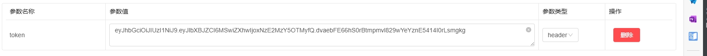
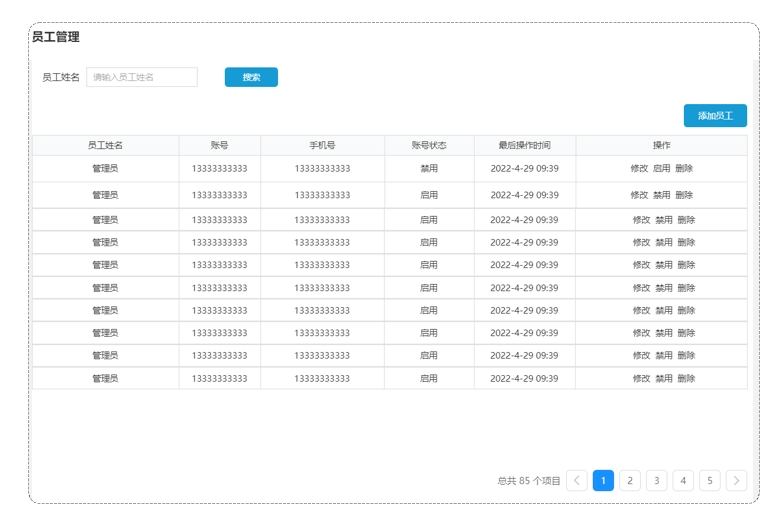
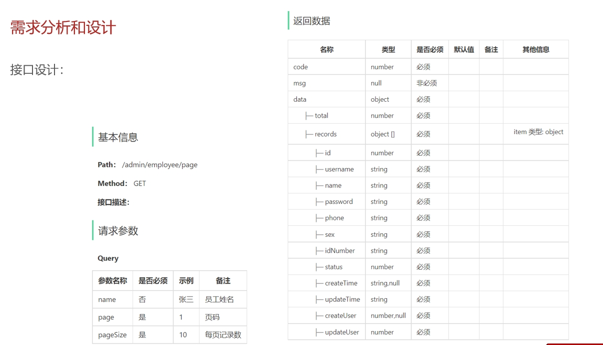
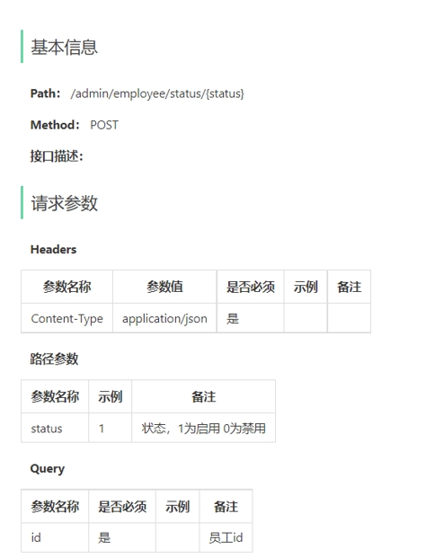
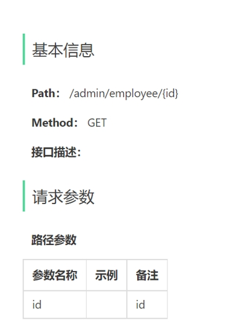

# 外卖 Day2

## 新增员工

当前端提交的数据与实体类数据相差较大时，建议使用DTO来封装数据

因为DTO与实体类大部分属性相同，所以可以使用**BeanUtils.copyProperties(）**方法进行一部分复制，再进行手动复制。

代码编写顺序，建议从Mapper层 ---> Service层 ---->Controller层，

//TODO可以进行标记，用于后期增加代码

Controller层

```java
@PostMapping("")
    @ApiOperation("新增员工接口")
    public Result save(@RequestBody EmployeeDTO employeeDTO){
        log.info("新增员工： {}" ,employeeDTO);
        return Result.success();
    }
```


Service层

```java
	@Override
    public void insert(EmployeeDTO employeeDTO) {
        Employee employee = new Employee();
        BeanUtils.copyProperties(employeeDTO,employee);

        employee.setCreateTime(LocalDateTime.now());
        employee.setUpdateTime(LocalDateTime.now());
        employee.setPassword(DigestUtils.md5DigestAsHex(PasswordConstant.DEFAULT_PASSWORD.getBytes()));
        employee.setStatus(StatusConstant.ENABLE);

        //TODO 需要获取当时的用户
        employee.setCreateUser(123L);
        employee.setUpdateUser(123L);


    }
```


Mapper层

```java
	@Insert("insert into employee"+
            "(name, username, password, phone, sex, id_number, status, create_time, update_time, create_user, update_user)"+
            "values" + "(#{name}, #{username}, #{password}, #{phone}, #{sex}, #{idNumber}, #{status}, #{createTime},#{updateTime},#{createUser}, #{updateUser})")
    void insert(Employee employee);
```


### 接口文档使用

接口文档主要用于调试后端，因为在前端未完成时，无法进行前后端联调，接口文档就可以单独进行后端调试。


由于设置了**JwtTokenAdminInterceptor**拦截器，对请求进行令牌校验，所以首先在接口文档中设置全局参数token



然后就可以进行后端调试


### 代码优化

#### 1.相同用户名称创建时会报错：

增加一个报错Handler

```java
 public Result exceptionHandler(SQLIntegrityConstraintViolationException ex){

        //java.sql.SQLIntegrityConstraintViolationException: Duplicate entry 'zxc' for key 'idx_username'
        log.error("异常信息： {}" ,ex.getMessage());
        String message = ex.getMessage();
        if (message.contains("Duplicate entry")){
            String name = message.split(" ")[2];
            return Result.error(name + MessageConstant.ALREADY_EXISTS);
        }else {
            return Result.error(MessageConstant.UNKNOWN_ERROR);
        }
    }
```


#### 2.创建者Id和更改者Id

使用ThreadLocal设置每个线程的ID，也可以随时读出

```
 BaseContext.setCurrentId(empId);//设置
 
 employee.setCreateUser(BaseContext.getCurrentId());
 employee.setUpdateUser(BaseContext.getCurrentId());//读出
```


## 员工分页查询

### 分析与设计

#### 产品原型：



- 根据页码展现员工信息
- 每页展示10个数据
- 分页查询可以根据员工信息进行查询


#### 接口设计：




### 开发流程：

Mapper层 ：查询所有的用户，并以limit形式进行输出，或者根据name进行查询

Service层：根据名称(输入\不输入)，查询出相应的用户

Controller层：调用Service层对象


为了简化开发：引入了PageHelper插件，基于底层的mybaits的拦截器实现

#### PageHelper：

可以动态的设置分页查询

```java
PageHelper.startPage(0,10);
```

0是pageNum，10是pageSize

调用以后，就可以对其**下面一行**SQL与进行分页查询，而不需要使用limit语句

因为其返回是Page，(mybaits中专门用于分页查询的类)，所以我们Mapper层的输出应该是Page对象


### 优化：

在响应信息中，时间格式不正确，需要使用消息转换器，统一对日期类型进行格式化处理

```java
@Override
    protected void extendMessageConverters(List<HttpMessageConverter<?>> converters) {
        MappingJackson2HttpMessageConverter converter = new MappingJackson2HttpMessageConverter();

        converter.setObjectMapper(new JacksonObjectMapper());
        converters.add(0,converter);
    }
```

JacksonObjectMapper的代码是自定义的

```java
public class JacksonObjectMapper extends ObjectMapper {

    public static final String DEFAULT_DATE_FORMAT = "yyyy-MM-dd";
    //public static final String DEFAULT_DATE_TIME_FORMAT = "yyyy-MM-dd HH:mm:ss";
    public static final String DEFAULT_DATE_TIME_FORMAT = "yyyy-MM-dd HH:mm";
    public static final String DEFAULT_TIME_FORMAT = "HH:mm:ss";

    public JacksonObjectMapper() {
        super();
        //收到未知属性时不报异常
        this.configure(FAIL_ON_UNKNOWN_PROPERTIES, false);

        //反序列化时，属性不存在的兼容处理
        this.getDeserializationConfig().withoutFeatures(DeserializationFeature.FAIL_ON_UNKNOWN_PROPERTIES);

        SimpleModule simpleModule = new SimpleModule()
                .addDeserializer(LocalDateTime.class, new LocalDateTimeDeserializer(DateTimeFormatter.ofPattern(DEFAULT_DATE_TIME_FORMAT)))
                .addDeserializer(LocalDate.class, new LocalDateDeserializer(DateTimeFormatter.ofPattern(DEFAULT_DATE_FORMAT)))
                .addDeserializer(LocalTime.class, new LocalTimeDeserializer(DateTimeFormatter.ofPattern(DEFAULT_TIME_FORMAT)))
                .addSerializer(LocalDateTime.class, new LocalDateTimeSerializer(DateTimeFormatter.ofPattern(DEFAULT_DATE_TIME_FORMAT)))
                .addSerializer(LocalDate.class, new LocalDateSerializer(DateTimeFormatter.ofPattern(DEFAULT_DATE_FORMAT)))
                .addSerializer(LocalTime.class, new LocalTimeSerializer(DateTimeFormatter.ofPattern(DEFAULT_TIME_FORMAT)));

        //注册功能模块 例如，可以添加自定义序列化器和反序列化器
        this.registerModule(simpleModule);

    }

```


## 启动禁用员工账号

### 需求分析与设计

需求：对状态为“禁止”的员工账号进行“启动”操作；

​			对状态为“启动”的员工账号进行“禁止”操作；


接口设计：




请求参数有id与status(路径参数)

响应参数有：code、msg、data resultObject


### 开发流程

Mapper：

传入的参数是一个Employee对象，根据对象中的值进行修改

```xml
<update id="update" parameterType="com.sky.entity.Employee">
        update employee
        <set>
            <if test="username!=null ">username = #{username},</if>
            <if test="name!=null ">name = #{name},</if>
            <if test="password!=null ">password = #{password},</if>
            <if test="phone!=null ">phone = #{phone},</if>
            <if test="sex!=null ">sex = #{sex},</if>
            <if test="idNumber!=null ">id_number = #{idNumber},</if>
            <if test="updateTime!=null ">update_time = #{updateTime},</if>
            <if test="updateUser!=null ">update_user = #{updateUser},</if>
            <if test="status!=null ">status = #{status},</if>
        </set>
        where id = #{id}
    </update>
```


Service：

将前端发送的ID与Status封装为一个Employee，使用.build方法进行封装；

```java
@Override
    public void StarOrStop(Integer status, Long id) {
//        Employee employee = new Employee();
//        employee.setStatus(status);
//        employee.setId(id);
        Employee employee = Employee.builder()
                .status(status)
                .id(id)
                .build();
        employeeMapper.update(employee);
   }
```

Controller层：

调用Service层，返回Result:success

```java
 @PostMapping("/status/{status}")
    @ApiOperation("启动禁用员工账号")
    public Result StarOrStop(@PathVariable Integer status,Long id){
        log.info("启动禁用员工账号: {}，{}",status,id);
        employeeService.StarOrStop(status,id);
        return Result.success();
    }
```


## 编辑员工

### 需求分析与设计

涉及到两个接口：

- 根据ID查询员工信息
- 编辑员工信息




#### 根据id查询员工信息接口

请求参数：id；

返回参数：express对象


#### 编辑员工信息端口

请求参数：expressDTO对象

响应：Result对象

